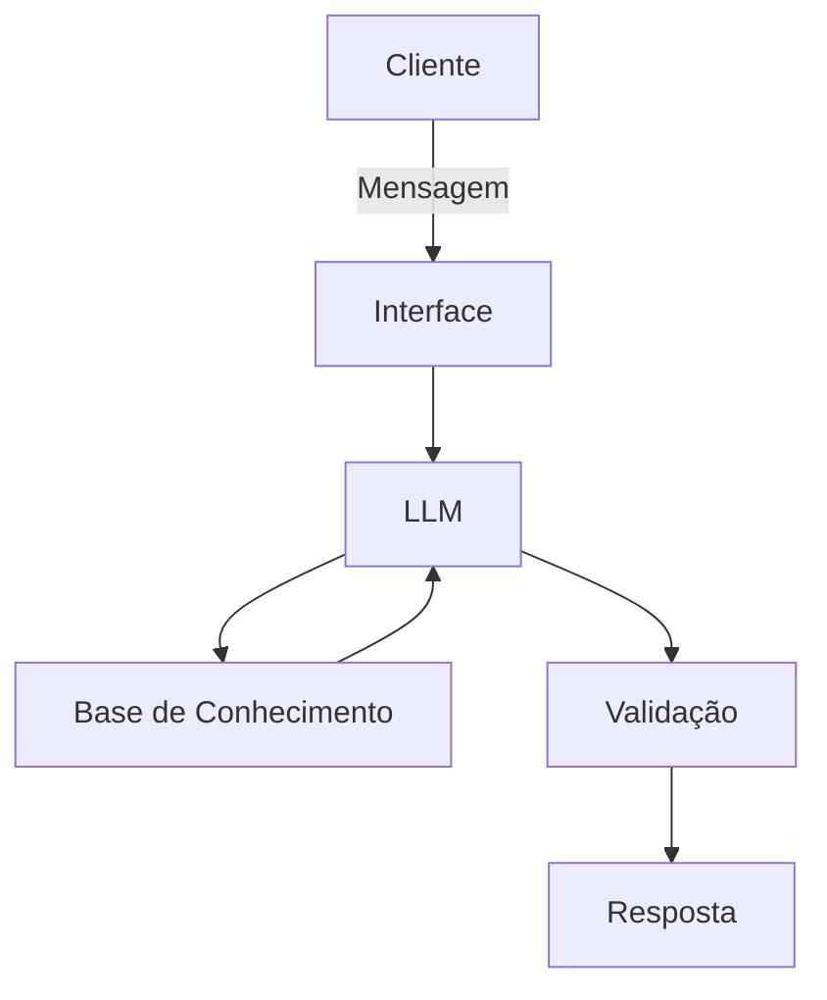

# Documentação do Agente

## Caso de Uso

### Problema
> Qual problema financeiro seu agente resolve?

Muitas pessoas tem dificuldade em controlar seus gastos mensais e acabam se endividando por falta de organização financeira. Elas não sabem exatamente para onde o dinheiro está indo e não conseguem planejar melhor suas finanças.

### Solução
> Como o agente resolve esse problema de forma proativa?

O agente ajuda o usuário a organizar seus gastos, identificar despesas desnecessárias e sugerir formas de economizar. Utilizando IA, ele analisa os dados financeiros e fornece recomendações personalizadas para melhorar o controle financeiro.

### Público-Alvo
> Quem vai usar esse agente?

O público-alvo são pessoas que desejam melhorar sua organização financeira, incluindo estudantes, trabalhadores e pequenos empreendedores que enfrentam dificuldades em controlar gastos, economizar e planejar suas finanças no dia a dia.

---

## Persona e Tom de Voz

### Nome do Agente
Jambalaya

### Personalidade
> Como o agente se comporta? (ex: consultivo, direto, educativo)

O agente possui uma personalidade consultiva, educativa e amigável. Ele se comunica de forma clara e objetiva, ajudando o usuário a entender melhor suas finanças sem utilizar termos complexos. Além disso, oferece orientações práticas e incentiva hábitos financeiros saudáveis, mantendo sempre um tom respeitoso e motivador.

### Tom de Comunicação
> Formal, informal, técnico, acessível?

O Tom de comunicação é acessível, claro e levemente informal, facilitando o entendimento de usuários com diferentes níveis de conhecimento financeiro. O agente evita termos técnicos complexos, explicando conceitos de forma simples e objetiva.

### Exemplos de Linguagem
- Saudação:  "Olá! Como posso ajudar com suas finanças hoje?"
- Confirmação: "Entendi! Deixa eu verificar isso para você."
- Erro/Limitação:  "Não tenho essa informação no momento, mas posso ajudar com esse tipo de investimento..."

---

## Arquitetura

### Diagrama

### Componentes

| Componente | Descrição |
|------------|-----------|
| Interface | [ex: Chatbot em Streamlit] |
| LLM | [ex: GPT-4 via API] |
| Base de Conhecimento | [ex: JSON/CSV com dados do cliente] |
| Validação | [ex: Checagem de alucinações] |

---

## Segurança e Anti-Alucinação

### Estratégias Adotadas

- [ ] [ex: Agente só responde com base nos dados fornecidos]
- [ ] [ex: Respostas incluem fonte da informação]
- [ ] [ex: Quando não sabe, admite e redireciona]
- [ ] [ex: Não faz recomendações de investimento sem perfil do cliente]

### Limitações Declaradas
> O que o agente NÃO faz?

O agente depende das informações do usuário para funcionar corretamente, podendo apresentar erros caso os dados estejam incompletos. Ele não substitui um especialista financeiro e suas sugestões devem ser usadas com cautela.
